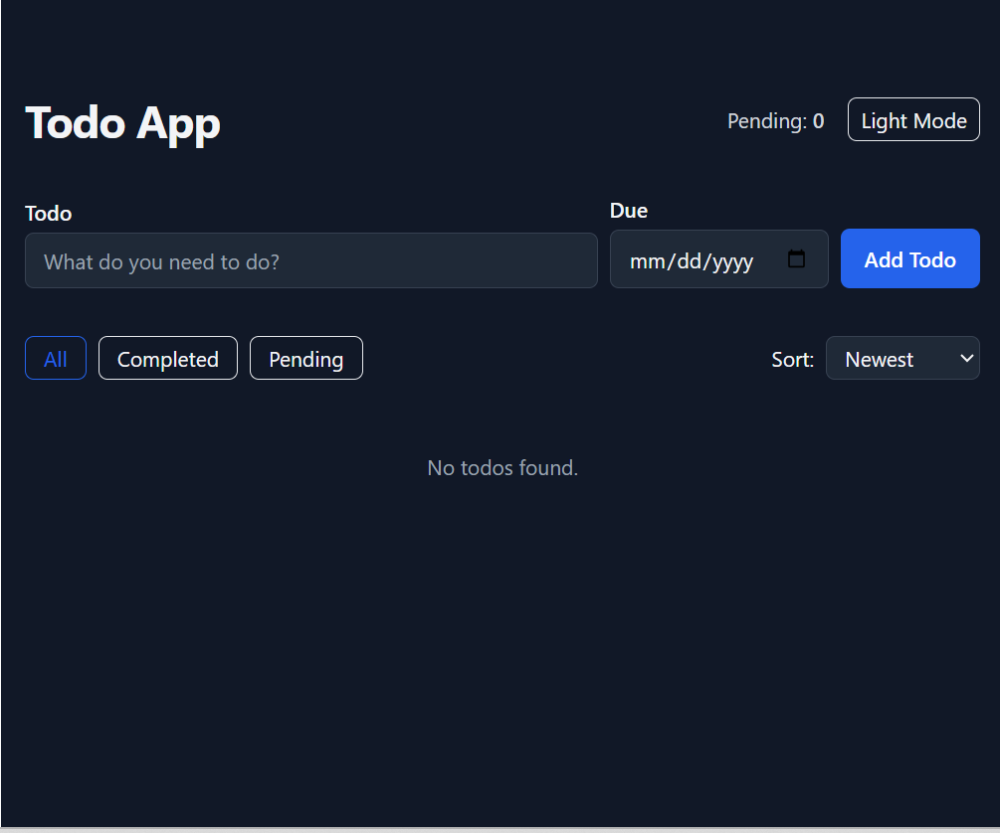

 Project Title and Short Description
Give your app a name and a 1–2 sentence explanation.

markdown
Copy
Edit
# 📝 Todo App with Dark Mode
A sleek and responsive Todo list built with React, Tailwind CSS, and Vite — with dark mode and animation support.
2. Live Demo Link (if deployed)
Add your deployed website link:

markdown
Copy
Edit
## 🚀 Live Demo
🔗 [Click here to try it](https://yourproject.vercel.app)
3. Screenshots / Preview
A visual look at your project. Add one or more screenshots (inside a public/ or assets/ folder):

markdown
Copy
Edit
##  Preview





4. Features
List main features:

markdown
Copy
Edit

##  Features

-  Add, edit, and delete todos
-  Mark as complete/incomplete
-  Filter tasks (All / Completed / Pending)
-  Dark and Light mode toggle
-  Responsive design with animations


5. Tech Stack / Technologies Used
Mention what tools/frameworks/libraries you used:

markdown
Copy
Edit
##  Technologies Used

- React
- Tailwind CSS
- Vite
- Framer Motion


6. Getting Started / Setup Instructions
Step-by-step setup instructions:

markdown
Copy
Edit
## 🧑‍💻 Getting Started

### Prerequisites
- Node.js (v18+)
- npm or yarn

### Installation

```bash
git clone https://github.com/pRAJIT09/react-todo-app.git
cd react-todo-app
npm install
npm run dev
yaml
Copy
Edit

---

### 7. Folder Structure

react-todo-app/
│
├── public/
├── src/
│   ├── components/   
│   ├── App.jsx
│   ├── main.jsx
│   └── index.css
│
├── postcss.config.js
├── tailwind.config.js
├── package.json
├── vite.config.js
├── README.md             


8. Deployment Instructions (if deployed manually)
markdown
Copy
Edit


## Deployment

This project can be easily deployed to [Vercel](https://vercel.com):

- Import your GitHub repo
- Set build command: `npm run build`
- Set output directory: `dist`


9. Future Improvements (Optional)
markdown
Copy
Edit


##  Future Improvements

- Add persistent storage (LocalStorage/Firebase)
- Add authentication for multi-user access
- Add due dates & reminders

10. License (Optional)
markdown
Copy
Edit


##  License

This project is licensed under the MIT License.